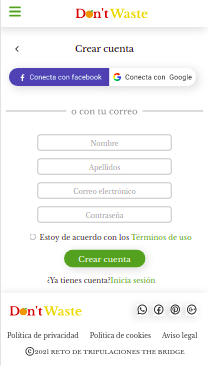
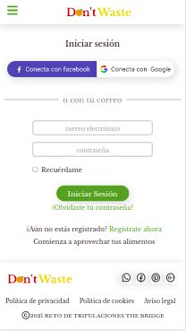
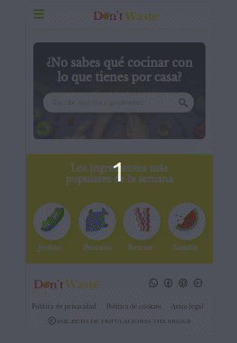
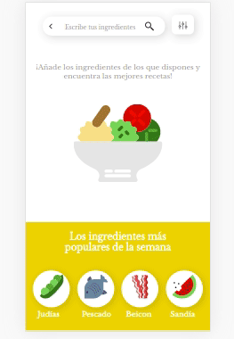

<!-- PROJECT LOGO -->
<br />
<p align="center">
    

<h4 align="center">Dont't Waste</h4>
  <p align="center">
    <a href="https://dontwasteapp.herokuapp.com/">View Web Application</a>
  </p>
  <p align="center">

</p>
<p align="center">
</p>

</p>

<!-- TABLE OF CONTENTS -->
<details open="open">
  <summary>Table of Contents</summary>
  <ol>
    <li><a href="#learn-more">Learn More</a></li>
    <li><a href="#prerequisites">Prerequisites</a></li>
    <li><a href="#installation">Installation</a></li>
    <li><a href="#about-the-project">About The Project</a></li>
    <li><a href="#app-overview">App Overview</a></li>
    <li><a href="#languages-and-tools">Languages and Tools</a></li>
    <li><a href="#contact">Contact</a></li>
  </ol>
</details>

## Learn more

To be more familiar with the libraries and frameworks I have mainly used I will leave a short explanation here:

### [React Router](https://reactrouter.com/)

npm install react-router-dom

React Router is a collection of navigational components that compose declaratively with your application. Whether you want to have bookmarkable URLs for your web app or a composable way to navigate in React Native, React Router works wherever React is rendering--so take your pick!  


### [Sass](https://sass-lang.com/)

npm install -g sass

Sass is a CSS preprocessor, which adds special features such as variables, nested rules and mixins (sometimes referred to as syntactic sugar) into regular CSS. The aim is to make the coding process simpler and more efficient.

### Prerequisites

- [Node](https://nodejs.org/en/): 10.16.0 or more  
- [React js](https://es.reactjs.org/)
- [Mongodb](https://www.mongodb.com/es)  
- [Mongoose](https://mongoosejs.com/)
- Clone the repository on your local machine (https://github.com/l0g0l/dont_waste.git)

## Installation

###### Frontend

```sh
`cd dont_waste` go into the folder
```

Install dependecies and devDependencies

```sh
npm i
```

Enter the following command

```sh
npm start
```

<!-- ABOUT THE PROJECT -->

## About The Project

Creation of a recipe web app (mobile first) whose search engine provides recipes according to the ingredient(s) you select and you can also filter by the type of food you want as well as allergens.
The application aims to ensure that food we have at home is not wasted, therefore, you can enter the ingredients in the search engine and it will return a series of recipes that contain them.


### Requirements  
-Create the architecture of the solution, and take charge of its implementation.
-Develop the front end of the app with React and the backend with node+express.
-The application must be mobile-first and SPA (single page application), so that there is no page reloading at any time, and only the minimum necessary content is loaded and rendered with each endpoint change.
-Choose the appropriate database (SQL or NoSQL) for each app depending on the data model required.
-Choose the right database (SQL or NoSQL) for the app depending on the data model needed.
-Version control management with GiT


<!-- APP OVERVIEW -->

## App Overview  

###### SignUp 



<br>
<br>

###### Login 



<br>
<br>

###### Home 



<br>
<br>

###### Search



<br>
<br>

<br>

<!-- ACKNOWLEDGEMENTS -->

## Languages and Tools:


The project is deployed in [Heroku](https://id.heroku.com/)  
<br>

<p align="left">
    <a href="https://sass-lang.com/" target="_blank"> 
        
    </a> 
    <a href="https://www.w3schools.com/css/" target="_blank"> 
        
    </a> 
    <a href="https://developer.mozilla.org/en-US/docs/Web/JavaScript" target="_blank">
        
    </a>
    <a href="https://www.mongodb.com/" target="_blank"> 
        
    </a>
    <a href="https://nodejs.org" target="_blank">
         
    </a>
      <a href="https://expressjs.com" target="_blank"> 
        
    </a>
    <a href="https://reactjs.org/" target="_blank">
        
    </a>  
    <a href="https://git-scm.com/" target="_blank">
        
    </a>
       <a href="https://www.heroku.com/home" target="_blank">
        
    </a>
    
</p>

<!-- CONTACT -->

## Contact

Lucía González

[](https://github.com/l0g0l)

[](https://www.linkedin.com/in/luciagonzalezlara)
